# PROJECT 7 : DEVOPS TOOLING WEBSITE SOLUTION

## STEP 1 – PREPARE NFS SERVER
 Provision a new EC2 instance with RHEL Linux 8 operating system, tag it NFS server and attach three additional volumes to the server

 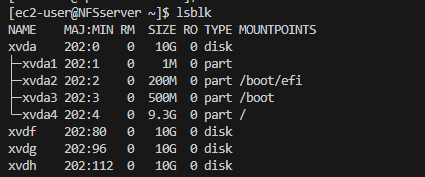

 1. Partition the three additional disks using gdisk 

 $ `sudo gdisk /dev/xvdf`

 $ `sudo gdisk /dev/xvdg`

 $ `sudo gdisk /dev/xvdh`

 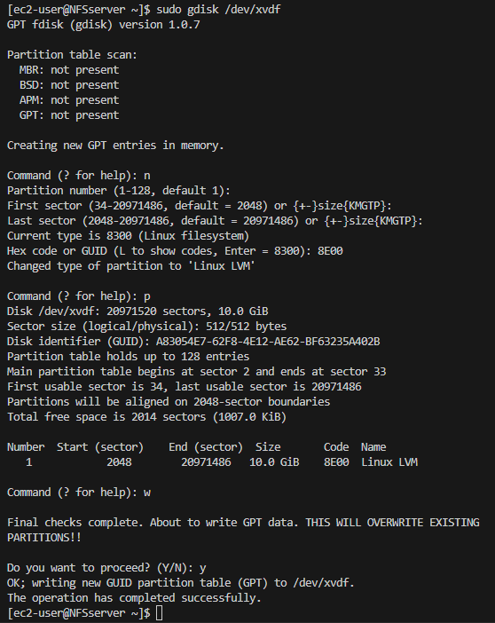

 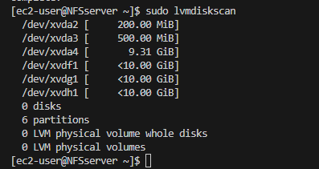

 Install the lvm tool using the folowing command

 $ `sudo yum install lvm2 -y`

 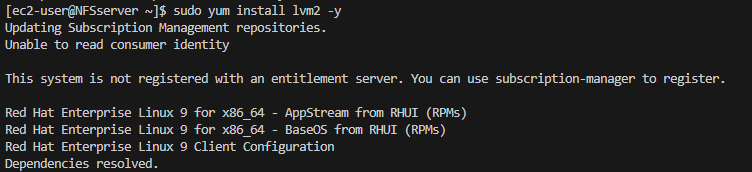

2.  Create three physical volumes

$ ` sudo pvcreate /dev/xvdf1`

$ `sudo pvcreate /dev/xvdg1`

$ `sudo pvcreate /dev/xvdh1`

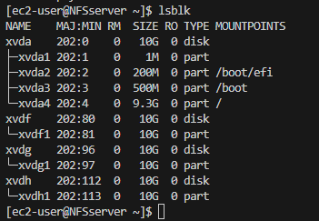

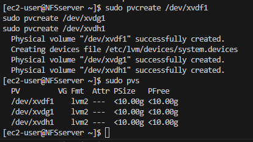

3. Create a volume group for the three logical volumes

$ `sudo vgcreate webdata-vg /dev/xvdh1  /dev/xvdg1 /dev/xvdf1`

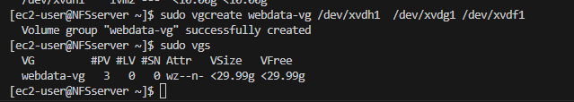

4. Create three logical volumes

$ `sudo lvcreate -n lv-apps -L 9G webdata-vg`

$ `sudo lvcreate -n lv-logs -L 9G webdata-vg`

$ `sudo lvcreate -n lv-opt -L 9G webdata-vg`

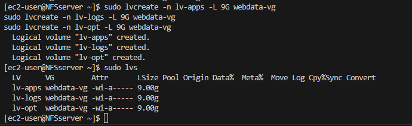
 
 5. Format the disks into xfs file system

 $ `sudo mkfs -t xfs /dev/webdata-vg/lv-apps`

$ `sudo mkfs -t xfs /dev/webdata-vg/lv-logs`

$ `sudo mkfs -t xfs /dev/webdata-vg/lv-opt`

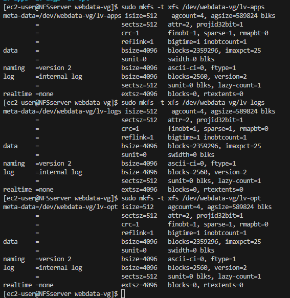

6.  Create mount points and mount the logical volumes

$ `sudo mkdir /mnt/apps`

$ `sudo mkdir /mnt/logs`

$ `sudo mkdir /mnt/opt`

7. Mount the logical volumes

$ `sudo mount /dev/webdata-vg/lv-apps /mnt/apps`

$ `sudo mount /dev/webdata-vg/lv-logs /mnt/logs`

$ `sudo mount /dev/webdata-vg/lv-opt /mnt/opt`

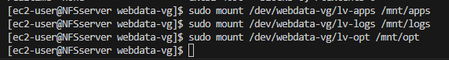

8. Install NFS server

$ `sudo yum -y update`

$ `sudo yum install nfs-utils -y`

9. Start NFS server

$ `sudo systemctl start nfs-server.service`

10. Enable NFS server to start automatically on reboot

$ `sudo systemctl enable nfs-server.service`

11. Confirm that NFS server is up and running

$ `sudo systemctl status nfs-server.service`

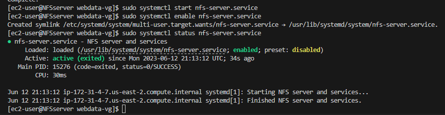

12. Set up permission that will allow our Web servers to read, write and execute files on NFS

$ `sudo chown -R nobody: /mnt/apps`

$ `sudo chown -R nobody: /mnt/logs`

$ `sudo chown -R nobody: /mnt/opt`

$ `sudo chmod -R 777 /mnt/apps`

$ `sudo chmod -R 777 /mnt/logs`

$ `sudo chmod -R 777 /mnt/opt`

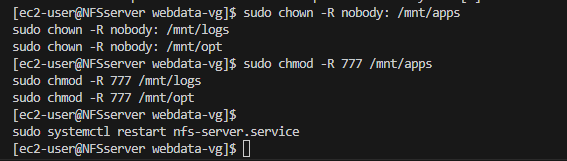

13. Restart NFS service

$ `sudo systemctl restart nfs-server.service`

14. Configure access to NFS for clients within the Web servers subnet using vim editor

$ `sudo vi /etc/exports`

Copy and paste the following commands

`/mnt/apps <Subnet-CIDR>(rw,sync,no_all_squash,no_root_squash)`

`/mnt/logs <Subnet-CIDR>(rw,sync,no_all_squash,no_root_squash)`

`/mnt/opt <Subnet-CIDR>(rw,sync,no_all_squash,no_root_squash)`

Save and exit vim 

`Esc + :wq!`

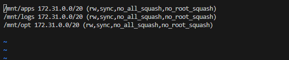

Export the mounts 

$ `sudo exportfs -arv`

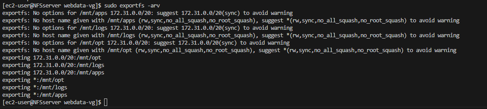

 In order for NFS server to be accessible from your client, open following ports: TCP 111, UDP 111, UDP 2049 , TCP 2049

## STEP 2 — CONFIGURE THE DATABASE SERVER

### we need to have a database server where our contents will be stored and accessed by the web servers

Provision a new EC2 instance with ubuntu linux oprerating system and call it Database server

1. Install MySQL server on the Database server

 $ `sudo apt update`

 $ `sudo apt install mysql-server`

 $ `sudo systemctl enable mysql`

 $ `sudo systemctl start mysql`

 2. Change the root user’s authentication method to one that uses a password

 $ `sudo mysql`

 mysql>  `ALTER USER 'root'@'localhost' IDENTIFIED WITH mysql_native_password BY 'password';`

 mysql> `exit;`

 3. Login to mysql as the root user, create a database and name it tooling

 $ `sudo mysql`

 mysql> `create database tooling;`

 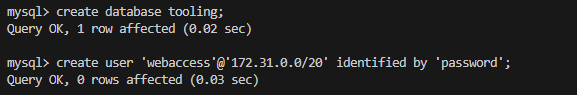

 mysql> `use tooling;`

 mysql> `create user 'webaccess'@'172.31.80.0/20' identified by 'password';`

 mysql> `grant all privileges on tooling.* to 'webaccess'@172.31.80.0/20';`

 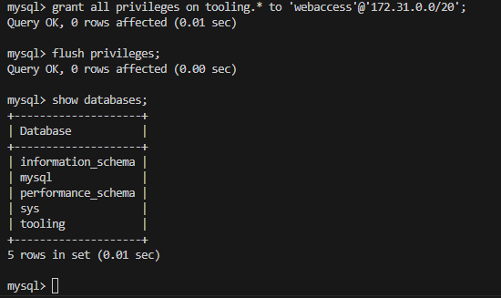

 mysql> `exit;`

 ## STEP 3 - PREPARE WEB SERVERS

We will provision three EC2 instances using RHEL 8 Operating system and name them web servers
 ### Configure NFS client on the web servers

 $ `sudo yum install nfs-utils nfs4-acl-tools -y`

 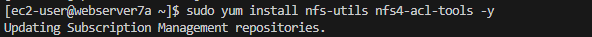

 2.  Mount /var/www/ and target the NFS server’s export for apps

$ `sudo mkdir /var/www`

$ `sudo mount -t nfs -o rw,nosuid <NFS-Server-Private-IP-Address>:/mnt/apps /var/www`

Verify that NFS was mounted successfully by running `df -h`.

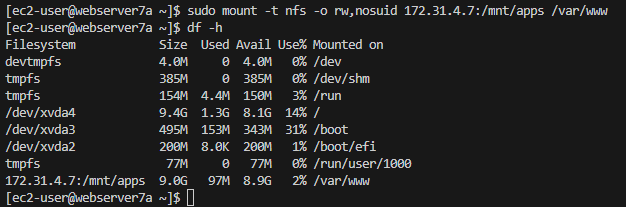

 3. To ensure that the change will persist after reboot, run the foloowing command on Web Server
 
$ `sudo vi /etc/fstab`

Copy and paste the below command

    <NFS-Server-Private-IP-Address>:/mnt/apps /var/www nfs defaults 0 0

Exit vi

Esc:wq!

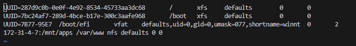

 4. Install httpd and PHP on the web servers

 $ `sudo yum install httpd -y`

$ `sudo dnf install https://dl.fedoraproject.org/pub/epel/epel-release-latest-8.noarch.rpm`

$ `sudo dnf install dnf-utils http://rpms.remirepo.net/enterprise/remi-release-8.rpm`

$ `sudo dnf module reset php`

$ `sudo dnf module enable php:remi-7.4`

$ `sudo dnf install php php-opcache php-gd php-curl php-mysqlnd`

$ `sudo systemctl start php-fpm`

$ `sudo systemctl enable php-fpm`

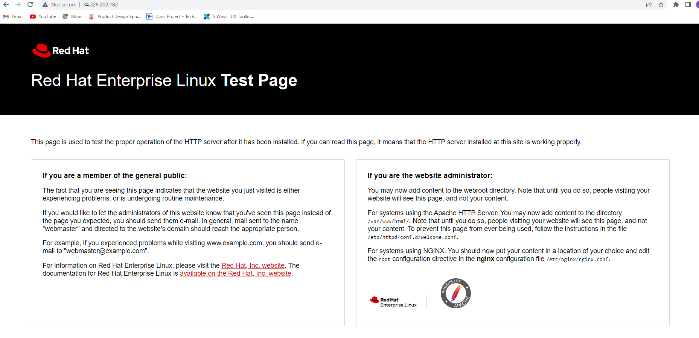

5. Verify that Apache files and directories are available on the Web Server in /var/www and also on the NFS server in /mnt/apps. If you see the same files – it means NFS is mounted correctly.

6. Locate the log folder for Apache on the Web Servers and mount it to NFS server’s export for logs by running the following command

$  `sudo mount -t nfs -o rw,nosuid <NFS-Server-Private-IP-Address>:/mnt/logs /var/log/httpd`

To ensure that the change will persist after reboot, run the foloowing command on Web Server
 
`sudo vi /etc/fstab `

Copy and paste the below command

    <NFS-Server-Private-IP-Address>:/mnt/logs /var/log/httpd nfs defaults 0 0

Exit vi

Esc:wq!

7. Fork the tooling source code from Darey.io Github Account to your Github account.

8. Deploy the tooling website’s code to the Webserver. Ensure that the html folder from the repository is deployed to /var/www/html

Open port 80 on the web servers

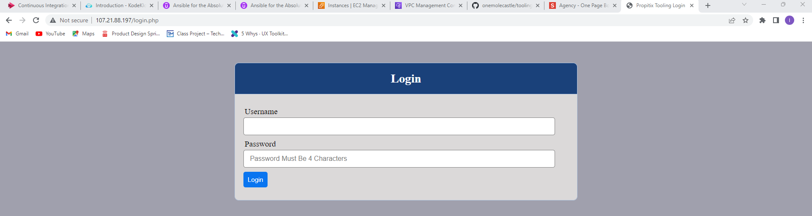

9. Update the website’s configuration to connect to the database (in /var/www/html/functions.php file). Apply tooling-db.sql script to your database using this command mysql -h <databse-private-ip> -u <db-username> -p <db-pasword> < tooling-db.sql

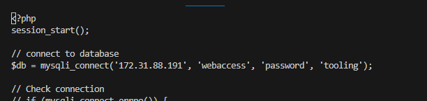

10. Create in MySQL a new admin user with username: myuser and password: password:

NSERT INTO ‘users’ (‘id’, ‘username’, ‘password’, ’email’, ‘user_type’, ‘status’) VALUES
-> (1, ‘myuser’, ‘5f4dcc3b5aa765d61d8327deb882cf99’, ‘user@mail.com’, ‘admin’, ‘1’);

11. Open the website in your browser http://<Web-Server-Public-IP-Address-or-Public-DNS-Name>/index.php and make sure you can login into the website with myuser user.

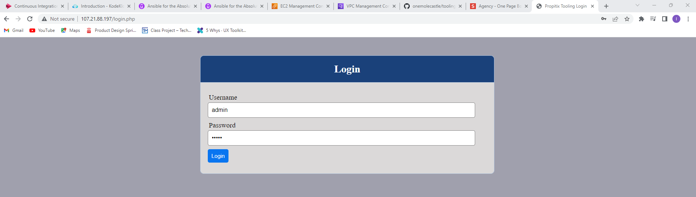

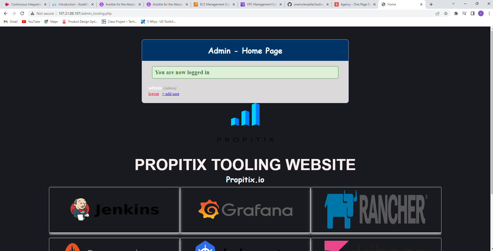

